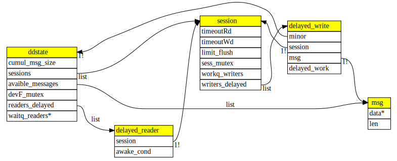

# Linux Timed Messaging System

This is a Linux Device Driver for exchanging messages among threads, with the possibility to get-post data with a definible timeout through an ioctl interface.
Messages posted to a device file are indipendent data units and are delivered to the readers in FIFO order.

Tested on Debian 10.2, Kernel Version 4.19.132-1 as a virtual machine into QEMU/KVM
Developped as project of the course Advanced Operating Systems in the University of Rome Tor Vergata.

## Features

The Device Driver support a compile-time configurable number of device file (MACRO *NUM_MINOR*)  associated to different minor numbers. 
Each instance support concurrent IO sessions, which operative mode may be configured through ioctl commands listed below.

### ioctl interface
-SET_SEND_TIMEOUT:			the current IO session stores messages after a timeout defined in the ioctl arg but a write() operation immediately return.

-SET_RECV_TIMEOUT:			the current I/O session allows a thread calling a read() operation to resume its execution after a timeout even if no message is currently present.

-REVOKE_DELAYED_MESSAGES:	undo message-post operations, that have occurred in the calling session, 
							of messages that have not yet been stored into the device file because their not yet expired send-timeout 

-LIMIT_FLUSH_SESS_TOGGLE:	toggle a flag of the calling session (*limit_flush* default set to false). If true, effects of later calls to flush() will be limited to this session

-FLUSH:						call flush(). Unblock all threads waiting for messages and revoke all the delayed messages not yet delivered
							if session.limit_flush is non zero:
								 readers unblocked will be ones of the current session (any if shared IOsession)
								 delayed messages revoked will be the ones generated from the current session.

-DEL_STORED_MESSAGES:		delete messages stored in the device file related to the calling session.
							If the given arg is non zero, all messages stored in all dev. file will be removed

### Module's MACROs:
-*TIMEOUT_DEF_MILLIS*:	the arg of *ioctl* from the timeoutset commands is interpretated as a value in milliseconds, so it's converted to jiffies via the *HZ* macro.
						Otherwhise arg is interpretated as the timeout in jiffies directly

-*SHRD_IOSESS_WARN_AND_SERIALIZE*:	in case of race conditions caused by shared IOsessions (e.g. open(), then some flavor of clone() )
									serialize threads (via a session's mutex) and print an information

-*QUIET*:						   disable aux macro for logging information on the kernel ring buffer

### /sys exported parameters
The module expose on the /sys filesystem the following parameters:

-Major:				the assigned major number from the OS to the dev.driver via *__register_chrdev*  (readonly)

-max_message_size:	maximum size (bytes) currently allowed for posting messages to the device file	 (read-write)

-max_storage_size:  maximum number of bytes globally allowed for keeping messages in the device file (read-write)

## Internals

The core structures used in this device driver are illustrated in a scheme builded with the dot language below.

__ddstate__ rappresent an instance of the device file with a given minor number.
It contains lists for all the opened IOsessions, all stored messages, and all pending reads waiting on a wait_queue
operations that modify these informations concurrently are serialized via a mutex

__session__ rappresent an opened IOsession linked to the relative struct file as *file->private_data*
It contains the timeouts discussed above, a list of all delayed writes on a workqueue
and a flag to limit later calls to flush() (so a close on an IOsession may don't bother other IOsessions)
Concurrent operation on a session may be for example a flush() called from another session and the current session that is adding/removing a defered write 
or exists shared IOsessions that may read-write session's variables (see macro SHRD_IOSESS_WARN_AND_SERIALIZE)
These concurrent operation are serialized via a session mutex

__delayed_write__ rappresent a deferred write operation on a workqueue, 
it's linked to the message to post and to the relative session (to access the session's mutex) and to the relative ddstate (to actually post the message)

__delayed_reader__ rappresent a deferred read operation on a waitqueue, it has a field *awake_cond* to get notification from other sessions.
When awakened, a deferred reader may found on this flag: *MSGREADY* if some message has been posted by a writer, or *FLUSHED* if a flush has been called

__msg__ rappresent a posted message
is basic struct holding a pointer to some data, and a field,*len* with the len of the data

## Install
Just call the bash script init.sh that will build the module, insert it with *insmod* create the char device files, linking them to the dev.file's assigned major number via the exported parameter *Major*

## Core Tests
### Random messages
The majority of the tests write on the device random messages composed of random numbers of random, bounded lenght, formatted as a string, with a numeric progressive prefix.
the random data is readed from the linux device file /dev/urandom 

#### simple_test 
just write a configurable amount of messages to a given device file, then read them
#### ddriver_test
write and read a series of random messages in a group of device files
Messages to write are generated randomly,printed and assigned in subset to each thread.
Each thread is assigned to a number of messages that will read and write on the device file.
The ammount of messages to exchange and the actual operation (read or write) is chosen randomly in each iteration.
At the end, messages readed by the threads are printed.
Piping the output of the test to the bash script check.sh will check if each generated message has a corresponding readed messages by any thread in any device.
#### time_test
bind 2 threads to respectivelly write and read 1 message at the time on one device file.
Will be mesured the time elapsed after each write and each read, using random timeouts.
The thread start each iteration together via a pthread_barrier
Because the reader's timeout is set as twice of the writer's one. the time mesured by the reader rappresent the ammount of time it has waited on the wait queue until the message post from the other thread has propagated. So this value will reflect the delay experienced by writer.
Here below are present some mesured delayes by the reader thread.

selected timeout: 54 millis
0.055476 secs
0.055981 secs
0.056067 secs
0.055841 secs

selected timeout: 96 millis
0.098423 secs
0.100111 secs
0.099928 secs
0.099872 secs

It's possible to notice as the mesured delays  are quite near to the timeout of the writer.
##### time mesuring 
the time elasped after each operation is mesured with either the syscall *gettimeofday* or via the GCC's X86 intrinsics *__rdtscp*.

The macro GETTIME rappresent a common interface between these 2 functions, and can be configured to map to *gettimeofday* if the macro GETTIMEOFDAY is defined, otherwise will map to *__rdtscp*.

To convert the  processor's time-stamp counter in time units it's used the linux symbol tsc_khz.
This value is defined from the Makefile to this test calling the bash script tsc_khz_get.sh that will get it using /proc/kallsyms

